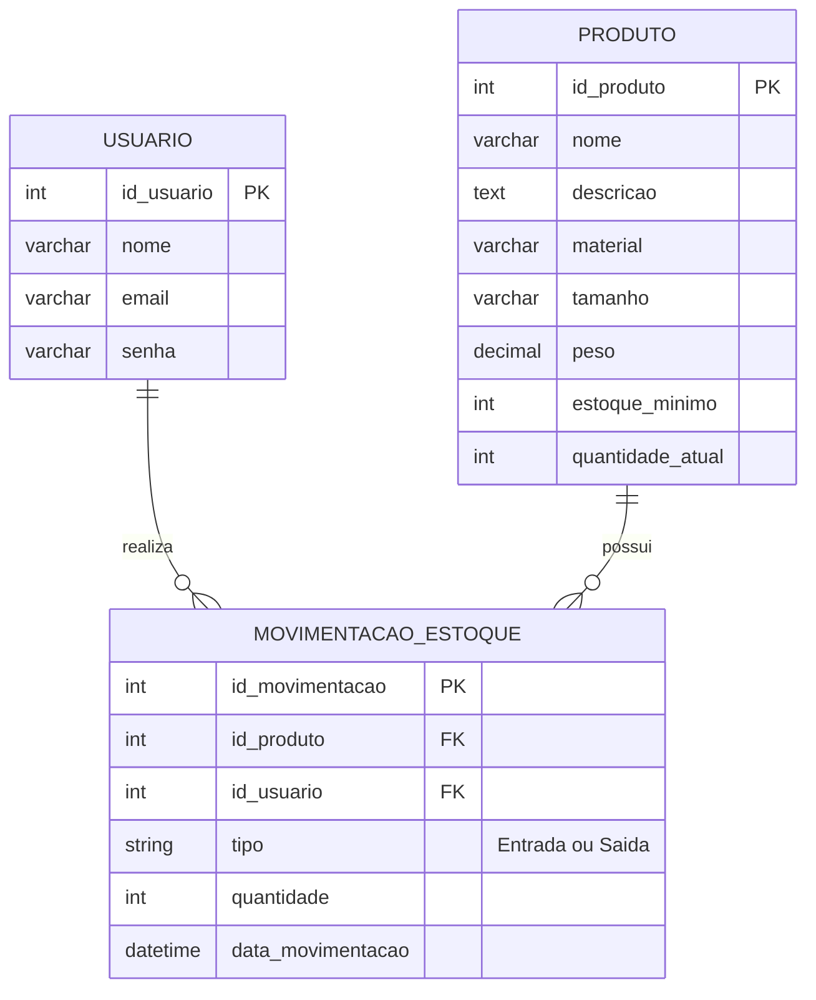

# Documentação do Projeto - SAEP

## Entrega Nº 1 - Lista de Requisitos Funcionais

Com base na descrição e nas especificações do desafio, o sistema deverá atender aos seguintes Requisitos Funcionais (RF):

### 1. Módulo de Autenticação (Login)
* **RF01 - Autenticação de Usuário:** O sistema deve permitir que os usuários façam login. Em caso de falha na autenticação, o sistema deve informar o motivo da falha ao usuário e redirecioná-lo novamente à tela de login.

### 2. Interface Principal
* **RF02 - Identificação do Usuário:** A interface principal deve exibir o nome do usuário logado no sistema.
* **RF03 - Logout:** A interface principal deve possuir um meio para o usuário fazer logout, redirecionando-o para a tela de autenticação.
* **RF04 - Navegação:** O sistema deve fornecer na interface principal meios de acesso para as telas de "Cadastro de Produto" e "Gestão de Estoque".

### 3. Módulo de Cadastro de Produtos
* **RF05 - Listagem de Produtos:** Ao acessar a interface, o sistema deve carregar e listar automaticamente em uma tabela todos os produtos já cadastrados no banco de dados.
* **RF06 - Busca de Produtos:** O sistema deve incluir um campo de busca que, após a inserção de um termo e confirmação pelo usuário, atualize a listagem da tabela exibindo apenas os registros correspondentes.
* **RF07 - Inserção de Produto:** O sistema deve permitir a inserção de novos produtos no banco de dados, incluindo suas especificidades (ex: material, tamanho, peso, revestimento, estoque mínimo, etc.).
* **RF08 - Edição de Produto:** O sistema deve permitir que o usuário realize a edição dos dados de um produto existente.
* **RF09 - Exclusão de Produto:** O sistema deve permitir a exclusão de um produto previamente cadastrado no banco de dados.
* **RF10 - Validação de Dados:** O sistema deve validar os dados inseridos (na criação ou edição) e exibir alertas caso haja ausência de informações obrigatórias ou inserção inválida de dados.
* **RF11 - Retorno à Tela Principal:** A interface deve possuir um meio para o usuário retornar facilmente à interface principal do sistema.

### 4. Módulo de Gestão de Estoque
* **RF12 - Ordenação Alfabética:** O sistema deve listar os produtos cadastrados em ordem alfabética, utilizando um algoritmo de ordenação específico.
* **RF13 - Registro de Movimentação:** O sistema deve permitir que o usuário selecione um produto e realize uma movimentação de estoque, especificando se é uma operação de "entrada" ou "saída".
* **RF14 - Data da Movimentação:** O sistema deve permitir a inserção ou registro da data da movimentação realizada.
* **RF15 - Alerta de Estoque Mínimo:** A cada movimentação de "saída", o sistema deve verificar o saldo atual e gerar um alerta automático caso o estoque do produto fique abaixo do valor mínimo previamente configurado.
* **RF16 - Histórico e Rastreabilidade:** O sistema deve registrar o histórico completo de cada movimentação de produto, vinculando o responsável (usuário) e a data da operação, para garantir transparência.

---

## Entrega Nº 2 - Diagrama Entidade Relacionamento (DER)

Abaixo está a modelagem do banco de dados relacional proposta (`saep_db`) para dar suporte aos requisitos do sistema. 

### Entidades e Dicionário de Dados

1. **Usuario** (Armazena as credenciais para o RF01 e identificação do RF02)
   * `id_usuario` (INT, Chave Primária, Auto Incremento)
   * `nome` (VARCHAR)
   * `email` (VARCHAR, Único)
   * `senha` (VARCHAR)

2. **Produto** (Armazena as características, cadastro e os níveis de estoque definidos na contextualização)
   * `id_produto` (INT, Chave Primária, Auto Incremento)
   * `nome` (VARCHAR) - *Ex: Martelo, Chave de fenda*
   * `descricao` (TEXT)
   * `material` (VARCHAR) - *Ex: Aço, Borracha*
   * `tamanho` (VARCHAR)
   * `peso` (DECIMAL)
   * `estoque_minimo` (INT)
   * `quantidade_atual` (INT)

3. **Movimentacao_Estoque** (Garante o histórico, rastreabilidade e a data das operações - RF16, RF13, RF14)
   * `id_movimentacao` (INT, Chave Primária, Auto Incremento)
   * `id_produto` (INT, Chave Estrangeira -> Produto)
   * `id_usuario` (INT, Chave Estrangeira -> Usuario)
   * `tipo` (ENUM: 'Entrada', 'Saída')
   * `quantidade` (INT)
   * `data_movimentacao` (DATE ou DATETIME)

### Representação Visual (Diagrama Mermaid)

