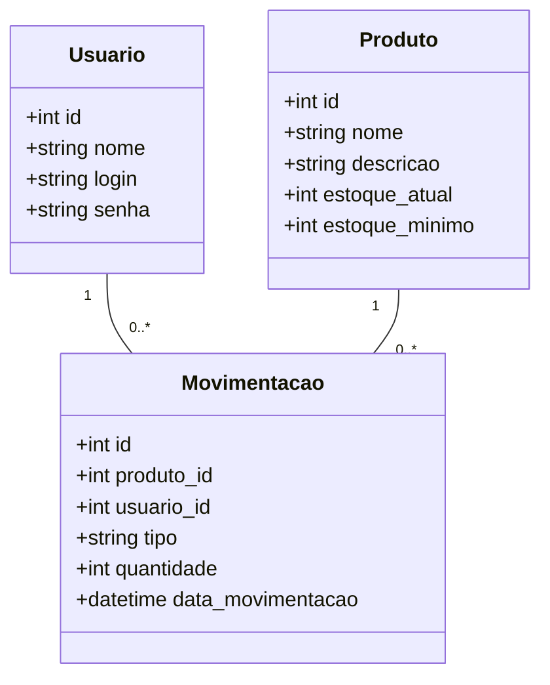

# Sistema de Gerenciamento de Almoxarifado - Fábrica de Ferramentas

## Contextualização

Uma fabricante de ferramentas e equipamentos manuais enfrenta desafios críticos na gestão de estoque devido à ausência de um sistema informatizado para controlar a entrada e saída de materiais, resultando em falta de produtos nos momentos cruciais da produção e excesso de estoque, o que gera custos elevados e risco de obsolescência. Dentre as características das ferramentas temos variações como martelos, que podem ter cabeças e cabos de diferentes materiais, e chaves de fenda, que variam em materiais e características como revestimento isolante ou ponta imantada, as quais exemplificam a complexidade da gestão, onde cada item possui especificidades de tamanho e peso que precisam ser adequadamente classificadas e controladas.

## Desafio

Desenvolver um sistema web ou desktop que permita ao usuário do almoxarifado cadastrar produtos, visualizar e gerenciar de forma intuitiva a entrada e saída de produtos. O sistema deve incluir um mecanismo de gerenciamento de estoque mínimo, que emite alertas automáticos quando o nível de estoque de qualquer produto fica abaixo do valor mínimo previamente configurado. Além disso, essa ferramenta deve registrar um histórico completo de cada movimentação, identificando o responsável e a data da operação, garantindo assim a rastreabilidade e a transparência dos processos.

## Escopo do Projeto

### 1. Introdução

Este Documento especifíca os requistos de software para o Sistema de Gestão de Almoxafifado (SGA). Será Desenvolvido uma aplicação web (BackEnd em Java SpringBoot e FrontEnd em Angular) que permita a autenticação do usuário, o gerenciamento (CRUD) de produtos e o registro de movimentações (entrada e saída) desses produtos, com alertas de estoque mínimo.

### 2. Requistos de InfraEstrutura e Ambiente [Entrega 9]

|Categoria |Especificações | Versão |
|-|-|-|
|Sistema Operacional | Windows | W11 |
|BackEnd | Java SpringBoot | Java 21 Spring 4.0 |
|FrontEnd | TypeScript (Angular) | Angular 21 |
|SGBD | PostgreSQL | 18 |

### 3. Requisitos do Sistema

#### 3.1. Requisitos Funcionais (RF)

- RF-01 : Tela de Login
- RF-02 : Avido Falha de Autenticação - Interface de Login
- RF-03 : Exibir Nome do Usuáio Logado - Interface Principal
- RF-04 : Botão de Logout - Interface Principal
- RF-05 : Navegação para Cadastro de Produtos e Gestão de Estoque - Interface Principal
- RF-06 : Listar Produtos Cadastrados - Gestão de Produtos
- RF-07 : Filtragem de Produtos - Gestão de Produtos
- RF-08 : Criação, Edição e Exclusão de Produtos - Gestão de Produtos
- RF-09 : Validação de Dados no Formulário
- RF-10 : Listar Produtos em Ordem Alfabética
- RF-11 : Selecionar operação de Entrada e Saída de Produtos
- RF-12 : Inserir Data de Movimentação
- RF-13 : Validação da Movimentação

### 4. Modelo Lógico de Dados [Entrega 02]

#### 4.1. Diagrama de Entidades Relacionais (DER)

### 5. Verificação e Teste de Software [Entrega 08]